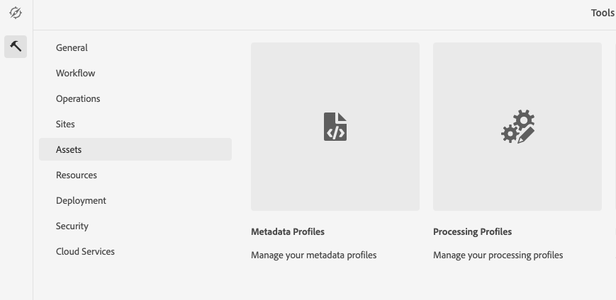
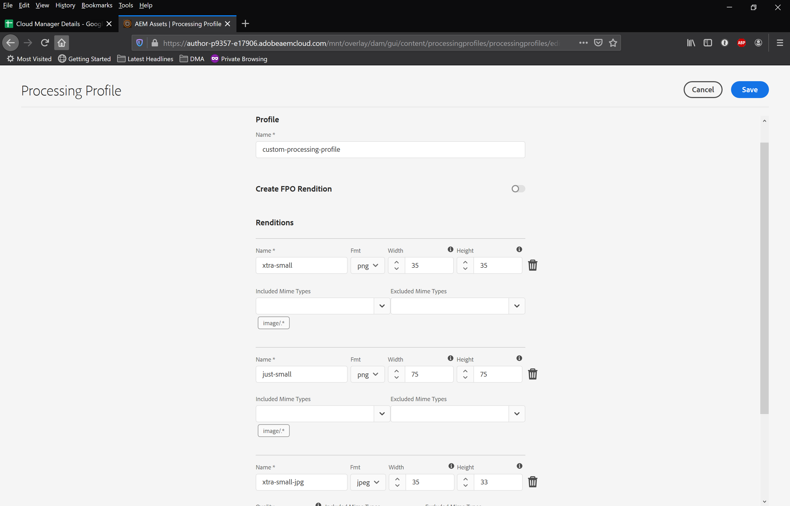
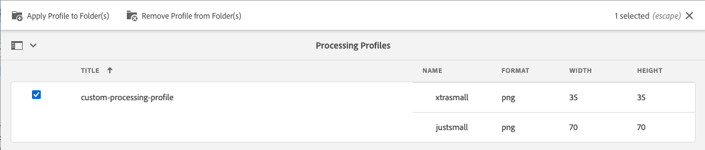
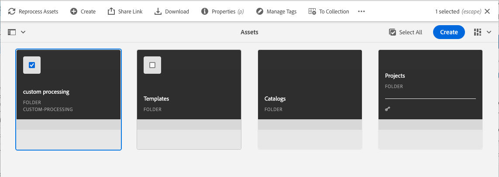
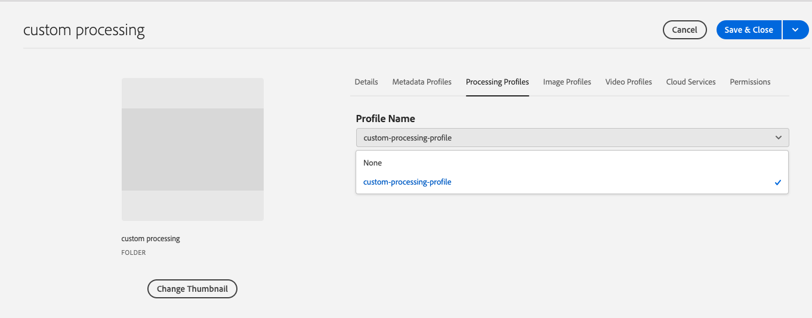
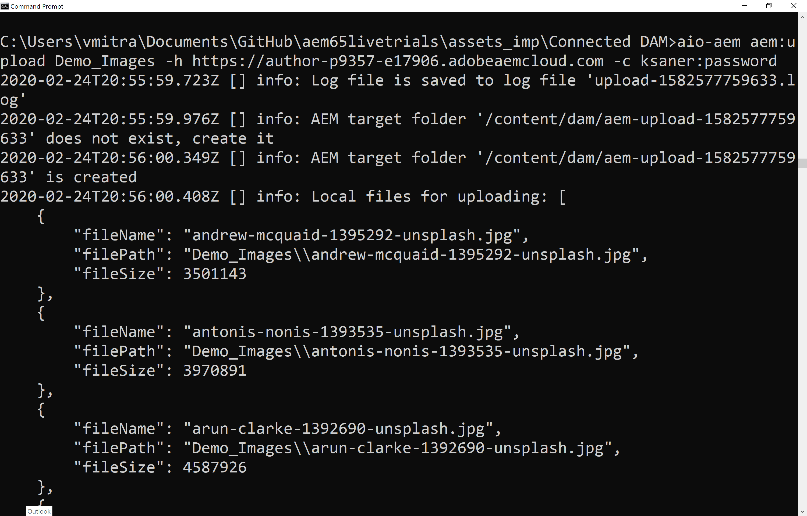
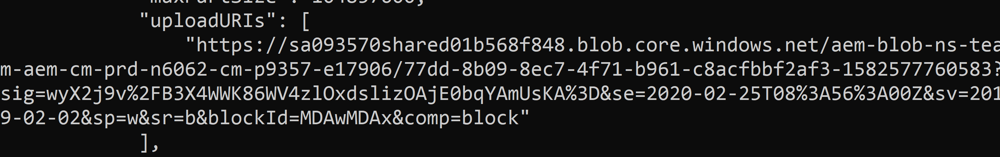

# Hands-on exercise:  Assets and Microservices

> This hands-on exercise builds on [Hands-on exercise: Search and Indexes](https://github.com/adobe/aem-cloud-engineering-video-series-exercises/tree/session7-indexes)

Now that you understand how to move content from AEM 6.x to AEM as a Cloud Service and index it, let's explore how AEM as a Cloud Service processes and renditions assets.

# Hands-on exercise: Search and Indexing

> This hands-on exercise builds on [Hands-on exercise: Migrating Content to AEM as a Cloud Service](https://github.com/adobe/aem-cloud-engineering-video-series-exercises/tree/session6-transfercontent)

Now that you understand how to move content from AEM 6.x to AEM as a Cloud Service, let's explore how to create custom indexes to AEM as a Cloud Service.

Apply your knowledge by trying out what you learned with this hands-on exercise.

## Supporting content 

Prior to trying the hands-on exercise, ensure you're familiar with the following topics, or review the following materials:

+[Asset Compute Microservices](https://experienceleague.adobe.com/docs/experience-manager-learn/cloud-service/migration/moving-to-aem-as-a-cloud-service/asset-compute-microservices.html?lang=en)

## Hands-on exercise steps

In this exercise, we will define a custom processing profile and apply it to an AEM assets folder.

1. Navigate to __Tools > Assets > Processing Profiles__

 > 
 
2. Click 'Create'

3. Provide a name for the new profile.

4. Create a custom rendition for png and jpg.

  Set the appropriate height and width.

> 

5. 'Save'

6. Select Profile and use the Apply Profile to Folder(s) wizard.

> 

7. You can also Assign/Remove Processing Profile to folder via folder properties page, to do so

  > Navigate to the desired folder <br>

Select folder and click the "Properties" button in the Action Bar

> 

Select Processing Profile from "Processing Profiles" tab

 <br>
 
8. Upload an asset to the folder.

9. Verify the custom renditions being generated.

#### Usage of Asset Upload Tool

This library supports uploading files to a target instance, while providing support for monitoring transfer progress, cancelling transfers, and other features.

To install the and use the command locally

> ``` npm install -g @adobe/aio-cli-plugin-aem ```

> ```  aio-aem (-v|--version|version) ```

> ``` aio-aem --help ```

#### Upload asset binaries to AEM

1. Navigate to AEM as a Cloud Service

2. Go to __Tools > Security > Users__

3. Create a new user, set his password and set user group to `administrators`.

4. Download these images (or use your own) [Demo_Images.zip](https://git.corp.adobe.com/aem-enablement/CloudAccelerationBootcamp/tree/session9/images)

5. Open command prompt/terminal

6. Run the following command
    > `aio-aem aem:upload path_to_Demo_Images_folder -h <AEM as Cloud Service Instance URL> -c username:password`

    e.g.
    > `aio-aem aem:upload Demo_Images -h https://author-pXXXX-eXXXX.adobeaemcloud.com -c uploadUsers:myPassword`

7. Following output should be displayed on the terminal window

    > 

    > Verify the uploadURIs pointing to azure blob storage

    > 
    
8. Go to Assets > Files > aem-upload-xxxxx and verify the uploaded assets

    > 
=======
+ [Repository Modernization](https://experienceleague.adobe.com/docs/experience-manager-learn/cloud-service/migration/moving-to-aem-as-a-cloud-service/repository-modernization.html?lang=en)
+ [Search and Indexing](https://experienceleague.adobe.com/docs/experience-manager-learn/cloud-service/migration/moving-to-aem-as-a-cloud-service/search-and-indexing.html?lang=en)

## Hands-on exercise steps

1. [Understand changes related to indexes in AEM as a Cloud Service](https://experienceleague.adobe.com/docs/experience-manager-cloud-service/operations/indexing.html?lang=en#changes-in-aem-as-a-cloud-service)
2. Clone [this Git repository](https://github.com/adobe/aem-cloud-engineering-video-series-exercises/tree/session7-indexes/new-index-content)
3. Clone [this Git repository](https://github.com/adobe/aem-cloud-engineering-video-series-exercises/tree/session7-indexes/sample-ethos-image)
4. Copy `/new-index-content/src/main/content/jcr_root/_oak_index` folder from the first Git repository clone to the Cloud Manager Git project
5. Modify the `filter.xml` to include the `_oak_index  folder
6. Add `<allowIndexDefinitions>true</allowIndexDefinitions>` to `filevault-package-maven-plugin` plugin configuration in parent `pom.xml`
7. Do a local maven build and deploy
8. Commit the new code with index definitions to Cloud Manager Git

# Hands-on exercise: Cloud Manager, Develop and Deploy

> This hands-on exercise builds on [Hands-on exercise: Onboarding](https://github.com/adobe/aem-cloud-engineering-video-series-exercises/tree/session3-onboarding)

Now that you understand the AEM as a Cloud Service onboarding process, and how to used Adobe Admin Console to provide access to Cloud Manager and AEM as a Cloud Service, let's explore how to deploy an AEM application to AEM as a Cloud Service using Cloud Manager.

Apply your knowledge by trying out what you learned with this hands-on exercise.

## Supporting content 

Prior to trying the hands-on exercise, ensure you're familiar with the following topics, or review the following materials:

+ [Adobe Cloud Manager](https://experienceleague.adobe.com/docs/experience-manager-learn/cloud-service/migration/moving-to-aem-as-a-cloud-service/cloud-manager.html?lang=en)
+ [aio CLI Cloud Manager plugin](https://github.com/adobe/aem-enablement/tree/master/AEMAsACloudService/11_CloudManager_AIO)

## Hands-on exercise steps

# Adobe Experience Manager Best Practice Analyzer code examples

This project is intended to illustrate example conditions identified by Adobe's Best Practice Analyzer (BPA) and how they can be remediated.

Please not that this Git repository contains a project rife with bad practices and incompatible code and configuration. These violations are used to illustrate a starting condition which can then be juxtaposed against the remediation for specific Best Practice Analyzer codes, broken out by Git branches.

## Legacy branch 

This branch is the starting point generated for Adobe's Maven Project Archetype 10 with several violations intentionally added.

## Best Practice Analyzer code branches

Adobe Best Practice Analyzer reports violations by [code](https://experienceleague.adobe.com/docs/experience-manager-pattern-detection/table-of-contents/aso.html), and each code provides details about what the violation is, and how to resolve it.

For violations this project's `main` Git branch a corresponding Git branch, in the format `code/<bpa code>` contains the changes required for resolve that, and only that, violation.

Performing a Github.com Compare between the `main` and `code/<bpa code>` provides a clear view of the changes required to mitigate the violation.
wknd-legacy

1. Configure your user in the Adobe Admin Console to have have full access to Adobe Cloud Manager.
1. Login to and explore Adobe Cloud manager.
1. Install the aio CLI and Cloud Manager plugin, and configure it for your development Program
1. Push the updated WKND Legacy project code to your Cloud Manager Git repository.
1. Attach a Cloud Manager pipeline to the WKND Legacy code in Cloud Manager Git
1. Trigger a build of the attached Cloud Manager pipeline using the Cloud Manager AIO Plugin. 
1. Validate in both Cloud Manager and with the aio CLI Cloud Manager plugin the Cloud Manager pipeline completed
